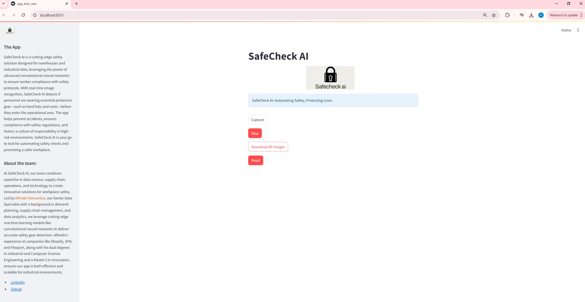

# Safecheck AI: Using Convolutional Neural Networks to Improve Safety at Warehouses

### Project Overview
**Safecheck AI** is a proof-of-concept designed to minimize the number of employees entering a warehouse floor without the appropriate safety gear, such as helmets and vests. By detecting when employees forget to wear this equipment, the system alerts the safety team, helping prevent accidents and ensuring compliance with safety standards.

### Target Users
This solution is intended for safety officers and warehouse management who are responsible for ensuring employee safety on the warehouse floor.

### System Requirements
To run Safecheck AI locally, the following Python libraries are required:
- numpy
- keras
- tensorflow
- PIL
- opencv-python (CV2)

Ensure you have these installed before proceeding.

### Data
The training data for Safecheck AI consists of images sourced from three open Kaggle datasets:

- [Employee Wearing Safety Gear](https://www.kaggle.com/datasets/khananikrahman/is-an-employee-wearing-safety-gear)
- [Safety Helmet and Reflective Jacket](https://www.kaggle.com/datasets/niravnaik/safety-helmet-and-reflective-jacket)
- [Negative Dataset](https://www.kaggle.com/datasets/ahmadahmadzada/images2000)

### Pre Processing
The images were preprocessed by resizing and rescaling, and data augmentation techniques such as random rotation, brightness, and contrast adjustments were applied to enhance model performance and minimize memorization of the training dataset.

### Model Architecture
The model used in Safecheck AI is a custom Convolutional Neural Network (CNN) with five convolutional layers. Below is a summary of the architecture:

The model does not use any pre-trained architectures. Instead, it was built from scratch using five convolutional layers, batch normalization, and max pooling, followed by dense layers for classification.

### Model Training
The model was trained on a dataset containing 12,000 images (positive and negative samples). The following settings were used:

- **Loss function**: binary_crossentropy
- **Optimizer**: Adam
- **Training duration**: 70 epochs
- **Performance metric**: Accuracy

Data augmentation techniques were applied to increase model robustness, and the final training accuracy was **93.79%**, with a validation accuracy of over **90%**.

### Usage
Safecheck AI runs as a web-based application using Streamlit. The app accesses the webcam to capture images every second, analyzes them in real-time, and provides continuous feedback on whether the person is wearing the appropriate safety gear.

- If the person is detected without a hard hat or vest, the app alerts the user with a notification.
- Users can also manually capture images from the webcam, which are saved with a timestamp and the model’s prediction.

### Performance
The model achieved an overall accuracy of **93.79%** on the training set and over **90%** on the validation set. This shows strong performance in detecting whether a person is wearing the required safety gear.

### Heatmaps and Visualizations
The following image shows a side-by-side comparison of the original image, the heatmap showing areas of focus, and the model’s prediction:

This image shows the pixels primarily impacting the result categorization are centered around the midsection of the worker, particularly around the vest. This indicates that the vest plays a significant role in determining the classification.

In this case, we can see that with a blank background, it is easier to see that the activation focuses mostly on the vest. Although the helmet activates some pixels near the edges, it does not impact the classification as strongly as the vest.

This image highlights how much the vest influences the classification. The edges around the vest (the boundary between vest and non-vest areas) seem to be defining the classification. However, one notable observation is that the more complex background captures some pixels, potentially leading to a false positive prediction. The contrasts and edges in the background, such as those from a painting, may cause unintended activation, increasing the chance of misclassification.

### Deployment
At this stage, Safecheck AI is a proof of concept and has not yet been deployed. Future plans include deploying the model in a live warehouse environment and implementing a re-training schedule to continuously improve the model’s accuracy based on locally acquired data.

The previous images illustrate the Safecheck AI proof of concept, showcasing the application in both idle and active states, where it performs real-time safety gear detection. The interface displays relevant project details, including information about the data scientist overseeing the project, as well as the current status of the app. These details can be toggled on or off as needed. The app also provides a live feed from the webcam, continuously updating with real-time predictions regarding the presence of safety gear. Additionally, users can view previously captured images along with their corresponding predictions. Below, you can find a video demonstrating the functionality of the working application.

### Future Improvements
One potential next step for Safecheck AI is to deploy the model in a warehouse, where it can continuously monitor safety compliance. Over time, the model can be re-trained with new data collected from the local environment to improve its accuracy and adapt to specific warehouse conditions. Re-training could occur on a schedule of 1, 3, and 6 months.
